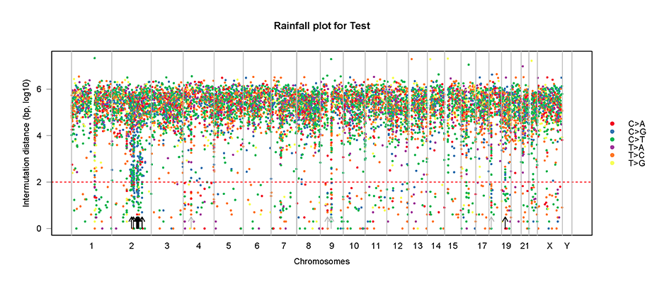
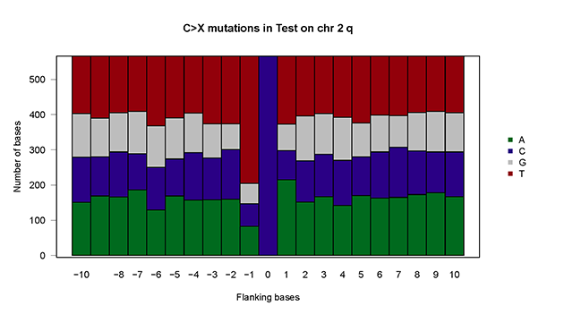

## KataegisPortal 

KataegisPortal is an R package that provides utilities to detect and visualize the Kataegis events from single nucleotide variants (SNVs). 

## Installation
```R
library(devtools)
install_github("MeichunCai/KataegisPortal")
```

## How to use

```R
# Load packages
library(KataegisPortal)
library(BSgenome)
library(BSgenome.Hsapiens.UCSC.hg19)

# Read in snv data
mutData <- "examples/mutData.txt"
mutData <- read.table(mutData, header = TRUE,sep = "\t",as.is = TRUE)
head(mutData)

# Covert to KataegisPortal input
mutSNP = mutSNP.input(mut.data = mutData,
			chr = "chr",
			pos = "pos",
			ref = "ref",
			alt = "alt",
			build = "hg19")

# Identify potential kataegis events
library(ChIPseeker)
library(TxDb.Hsapiens.UCSC.hg19.knownGene)
katPoint(mutSNP,txdb = TxDb.Hsapiens.UCSC.hg19.knownGene)
```

- weight.C>X: proportion of C>X mutations
- confidence: confidence degree of potential kataegis events (range: 0 to 3, 3 - high confidence)
```R
# Plot intermutation distance to display kataegis or hyper mutated genomic regions
mutDis.plot(plot.data = mutSNP, sample="Test")
```

```R
mutDis.plot(plot.data = mutSNP, sample="Test", chr = "chr2")
```

```R
# Plot of flanking sequence of all C>X mutations or C>X mutations within a chromosome/chromosome arm
baseSpe.plot(plot.data = mutSNP, sample="Test")
```

```R
baseSpe.plot(plot.data = mutSNP, sample="Test", chr = "chr2",arm="q")
```



